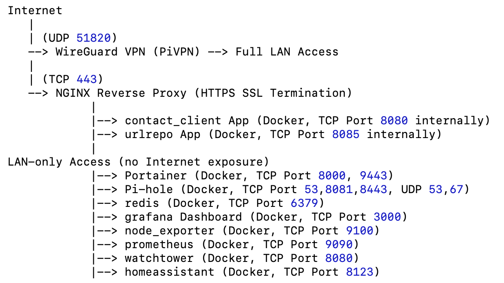
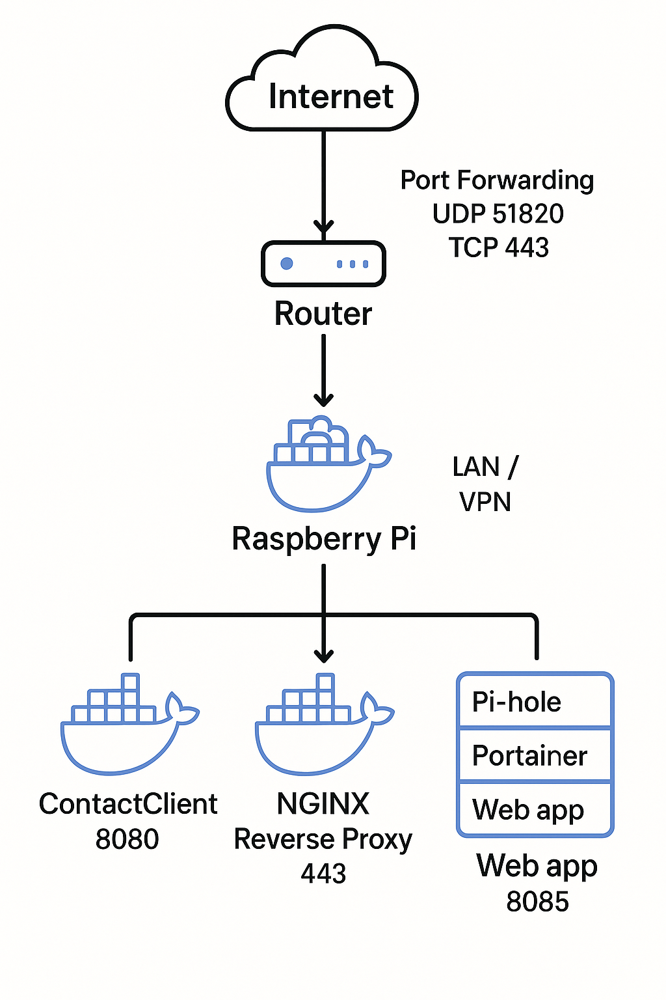

# RaspberryPi-HomeServer
Raspberry Pi Home Server Deployment, Preparation, Install and Secure Docker, WireGuard PiVPN Setup, Deploy Dockerized Services - Pi-hole DNS, Prometheus + Grafana Dashboard Monitoring RPI, Home Assistant, NGINX Reverse Proxy with SSL, Firewall Configuration (UFW), Router Port Forwarding

## 📈 Project Overview
This project turns a Raspberry Pi into a secure, resilient home server for self-hosted applications. All services are Dockerized, secured behind VPN and NGINX Reverse Proxy, with hardened network rules and minimal public exposure.

## 📡 System Architecture 
 

## 📄 Services and Exposure
| Service              | Docker?| Port(s) Exposed Internally                       | Port(s) Exposed Publicly| Protocol| Notes |
|----------------------|------- |--------------------------------------------------|-------------------------|---------|-------|
| WireGuard VPN (PiVPN)| Host   | 51820 (UDP)                                      | 51820 (UDP) (forwarded) | UDP     | VPN access only|
| NGINX Reverse Proxy  | Docker | 443 (mapped)                                     | 443 (TCP) (forwarded)   | TCP     | SSL termination|
| contact_client App   | Docker | 8080                                             | None                    | TCP     | Behind NGINX| 
| urlrepo App          | Docker | 8085                                             | None                    | TCP     | Behind NGINX|
| Portainer            | Docker | 8000, 9443                                       | None                    | TCP     | LAN/VPN only|
| Pi-hole              | Docker | 53 (TCP/UDP), 67 (UDP), 8081 (HTTP), 8443 (HTTPS)| None                    | TCP, UDP| LAN DNS Adblocker|
| Redis                | Docker | 6379                                             | None                    | TCP     | LAN-only|
| Grafana              | Docker | 3000                                             | None                    | TCP     | LAN dashboard|
| node_exporter        | Docker | 9100                                             | None                    | TCP     | Metrics|
| Prometheus           | Docker | 9090                                             | None                    | TCP     | Metrics|
| Watchtower           | Docker | 8080                                             | None                    | TCP     | Container auto-update|
| Home Assistant       | Docker | 8123                                             | None                    | TCP     | Smart home hub|
| RPi Connect          | Host   | 44353, 5367, 6780                                | None                    | TCP     | LAN/VPN only |

## 🖥 Raspberry Pi Preparation

```bash
ssh pi@<Raspberry Pi IP>
...
cat /etc/os-release
PRETTY_NAME="Raspbian GNU/Linux 12 (bookworm)"
NAME="Raspbian GNU/Linux"
VERSION_ID="12"
VERSION="12 (bookworm)"
VERSION_CODENAME=bookworm
ID=raspbian
ID_LIKE=debian
HOME_URL="http://www.raspbian.org/"
SUPPORT_URL="http://www.raspbian.org/RaspbianForums"
BUG_REPORT_URL="http://www.raspbian.org/RaspbianBugs"

uname -a
Linux raspberrypi 6.12.22-v8+ #1872 SMP PREEMPT Tue Apr 15 15:46:58 BST 2025 aarch64 GNU/Linux

sudo apt update && sudo apt upgrade -y
sudo reboot
```

 - ✅ OS Details
 - ✅ Static IP address configured in Router (DHCP reservation)
 - ✅ SSH hardened: PasswordAuthentication: No. PublicKeyAuthentication: Yes. Only key-based SSH access

## 🐳 Install and Secure Docker

```bash
curl -sSL https://get.docker.com | sh
sudo usermod -aG docker $USER
sudo apt install docker-compose-plugin -y
```
Enable and start Docker service:
```bash
sudo systemctl enable docker
sudo systemctl start docker
```

## 📦 Deploy Core Dockerized Services

**Portainer** Docker Management
```yaml
# ~/DockerApps/portainer/docker-compose.yml
version: '3'

services:
  portainer:
    image: portainer/portainer-ce:latest
    container_name: portainer
    restart: unless-stopped
    ports:
      - "8000:8000"
      - "9443:9443"
    volumes:
      - /var/run/docker.sock:/var/run/docker.sock
      - portainer_data:/data

volumes:
  portainer_data:
```
**Pi-hole** (LAN DNS Ad Blocker)

```bash
docker run -d \
  --name pihole \
  --restart=unless-stopped \
  --network bridge \
  -p 53:53/tcp -p 53:53/udp \
  -p 67:67/udp \
  -p 8081:80 \
  -p 8443:443 \
  -v etc-pihole:/etc/pihole \
  -v etc-dnsmasq.d:/etc/dnsmasq.d \
  --cap-add=NET_ADMIN \
  --dns=127.0.0.1 --dns=1.1.1.1 \
  -e TZ="America/New_York" \
  -e WEBPASSWORD="your_secure_password" \
  -e DNSMASQ_LISTENING=all \
  -e PIHOLE_DNS_="1.1.1.1;1.0.0.1" \
  pihole/pihole:latest

docker exec -it pihole pihole -g
```
Deploy Other Dockerized Services : Organize services under folders, e.g., /home/pi/DockerApps. (ContactClient, Dashboard, homeassistant, NPM,  URLRepo)

**Prometheus & Grafana Dashboard**
docker-compose.yml
```yaml
services:
  prometheus:
    image: prom/prometheus
    container_name: prometheus
    volumes:
      - ./prometheus:/etc/prometheus
      - prometheus_data:/prometheus
    network_mode: host
    ports:
      - "9090:9090"
    restart: always

  node_exporter:
    image: prom/node-exporter
    container_name: node_exporter
    ports:
      - "9100:9100"
    network_mode: host
    restart: always

  grafana:
    image: grafana/grafana
    container_name: grafana
    ports:
      - "3000:3000"
    network_mode: host
    volumes:
      - grafana_data:/var/lib/grafana
    restart: always

volumes:
  prometheus_data:
  grafana_data:
```


## 🛡️ WireGuard VPN Setup (via PiVPN)

```bash
curl -L https://install.pivpn.io | bash
```
During setup: Select WireGuard, choose default ports (51820/UDP)


🔍 After Install Useful Commands:

```bash
pivpn add             # Add clients
pivpn list            # View connected clients
pivpn -qr             # Export client QR code
pivpn -c              # View VPN status
pivpn -bk             # Backup PiVPN
pivpn -d              # Debug


sudo systemctl start wg-quick@wg0
sudo systemctl enable wg-quick@wg0
```
**Router Port Forwarding**: Forward 51820/UDP to your Raspberry Pi internal IP.


