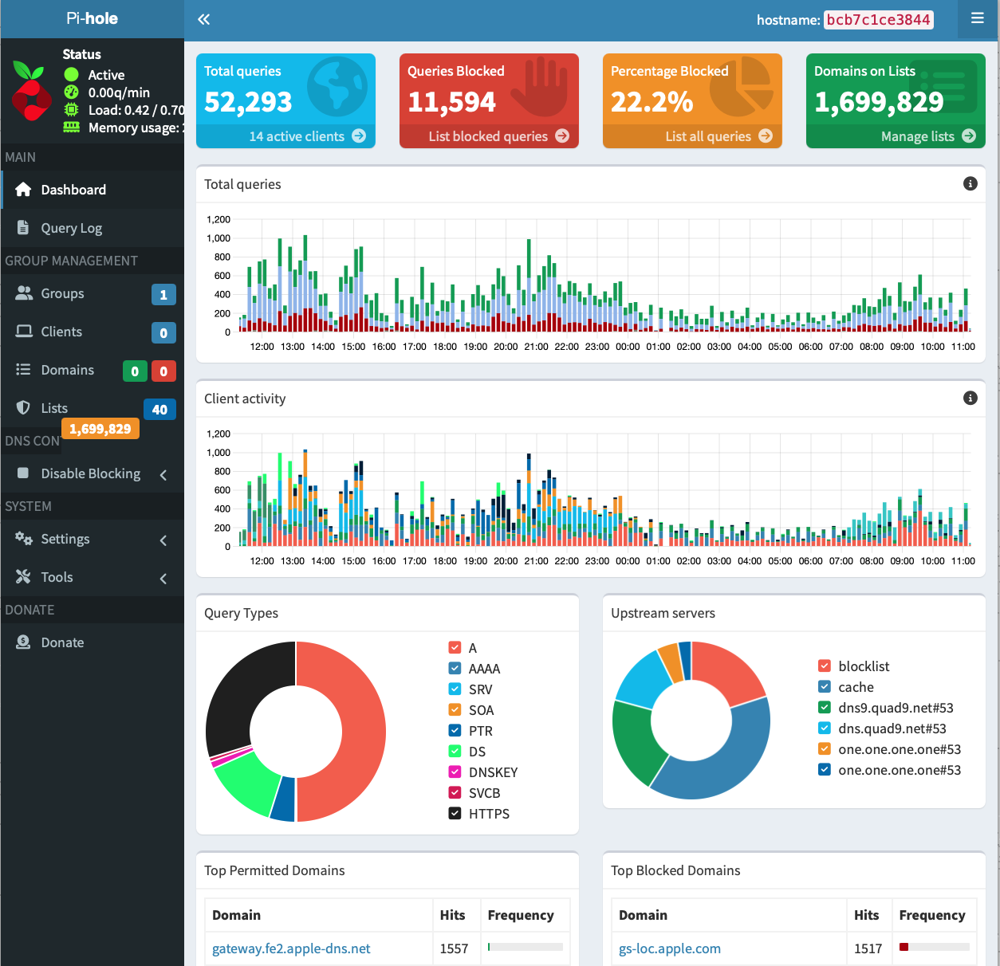
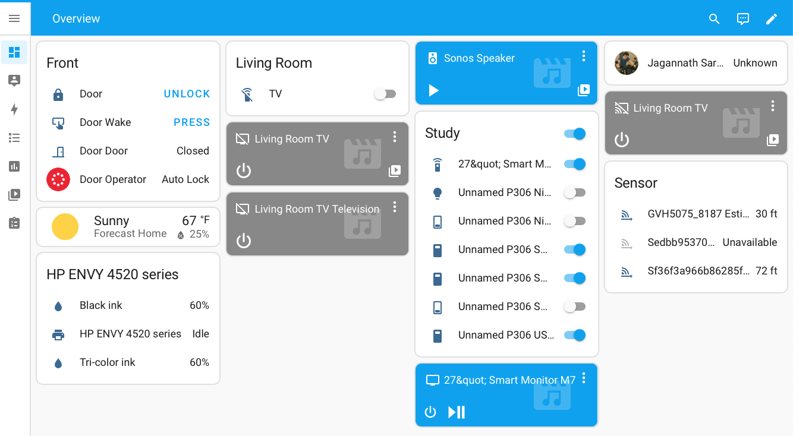

# RaspberryPi-HomeServer
Raspberry Pi Home Server Deployment, Preparation, Install and Secure Docker, WireGuard PiVPN Setup, Deploy Dockerized Services - Pi-hole DNS, Prometheus + Grafana Dashboard Monitoring RPI, Home Assistant, NGINX Reverse Proxy with SSL, Firewall Configuration (UFW), Router Port Forwarding

## 📈 Project Overview
This project turns a Raspberry Pi into a secure, resilient home server for self-hosted applications. All services are Dockerized, secured behind VPN and NGINX Reverse Proxy, with hardened network rules and minimal public exposure.

## 📡 System Architecture 
 

## 📄 Services and Exposure
| Service              | Docker?| Port(s) Exposed Internally                       | Port(s) Exposed Publicly| Protocol| Notes |
|----------------------|------- |--------------------------------------------------|-------------------------|---------|-------|
| WireGuard VPN (PiVPN)| Host   | 51820 (UDP)                                      | 51820 (UDP) (forwarded) | UDP     | VPN access only|
| NGINX Reverse Proxy  | Docker | 443 (mapped)                                     | 443 (TCP) (forwarded)   | TCP     | SSL termination|
| contact_client App   | Docker | 8080                                             | None                    | TCP     | Behind NGINX| 
| urlrepo App          | Docker | 8085                                             | None                    | TCP     | Behind NGINX|
| Portainer            | Docker | 8000, 9443                                       | None                    | TCP     | LAN/VPN only|
| Pi-hole              | Docker | 53 (TCP/UDP), 67 (UDP), 8081 (HTTP), 8443 (HTTPS)| None                    | TCP, UDP| LAN DNS Adblocker|
| Redis                | Docker | 6379                                             | None                    | TCP     | LAN-only|
| Grafana              | Docker | 3000                                             | None                    | TCP     | LAN dashboard|
| node_exporter        | Docker | 9100                                             | None                    | TCP     | Metrics|
| Prometheus           | Docker | 9090                                             | None                    | TCP     | Metrics|
| Watchtower           | Docker | 8080                                             | None                    | TCP     | Container auto-update|
| Home Assistant       | Docker | 8123                                             | None                    | TCP     | Smart home hub|
| RPi Connect          | Host   | 44353, 5367, 6780                                | None                    | TCP     | LAN/VPN only |

## 🖥 Raspberry Pi Preparation

```bash
ssh pi@<Raspberry Pi IP>
...
cat /etc/os-release
PRETTY_NAME="Raspbian GNU/Linux 12 (bookworm)"
NAME="Raspbian GNU/Linux"
VERSION_ID="12"
VERSION="12 (bookworm)"
VERSION_CODENAME=bookworm
ID=raspbian
ID_LIKE=debian
HOME_URL="http://www.raspbian.org/"
SUPPORT_URL="http://www.raspbian.org/RaspbianForums"
BUG_REPORT_URL="http://www.raspbian.org/RaspbianBugs"

uname -a
Linux raspberrypi 6.12.22-v8+ #1872 SMP PREEMPT Tue Apr 15 15:46:58 BST 2025 aarch64 GNU/Linux

sudo apt update && sudo apt upgrade -y
sudo reboot
```

 - ✅ OS Details
 - ✅ Static IP address configured in Router (DHCP reservation)
 - ✅ SSH hardened: PasswordAuthentication: No. PublicKeyAuthentication: Yes. Only key-based SSH access

## 🐳 Install and Secure Docker

```bash
curl -sSL https://get.docker.com | sh
sudo usermod -aG docker $USER
sudo apt install docker-compose-plugin -y
```
Enable and start Docker service:
```bash
sudo systemctl enable docker
sudo systemctl start docker
```

## 📦 Deploy Core Dockerized Services

**Portainer** Docker Management
```yaml
# ~/DockerApps/portainer/docker-compose.yml
version: '3'

services:
  portainer:
    image: portainer/portainer-ce:latest
    container_name: portainer
    restart: unless-stopped
    ports:
      - "8000:8000"
      - "9443:9443"
    volumes:
      - /var/run/docker.sock:/var/run/docker.sock
      - portainer_data:/data

volumes:
  portainer_data:
```
```bash
docker-compose up -d
```


**Pi-hole** (LAN DNS Ad Blocker)

```bash
docker run -d \
  --name pihole \
  --restart=unless-stopped \
  --network bridge \
  -p 53:53/tcp -p 53:53/udp \
  -p 67:67/udp \
  -p 8081:80 \
  -p 8443:443 \
  -v etc-pihole:/etc/pihole \
  -v etc-dnsmasq.d:/etc/dnsmasq.d \
  --cap-add=NET_ADMIN \
  --dns=127.0.0.1 --dns=1.1.1.1 \
  -e TZ="America/New_York" \
  -e WEBPASSWORD="your_secure_password" \
  -e DNSMASQ_LISTENING=all \
  -e PIHOLE_DNS_="1.1.1.1;1.0.0.1" \
  pihole/pihole:latest
```
After container is running (force rebuild gravity list)
```bash
docker exec -it pihole pihole -g
```
 

Deploy Other Dockerized Services : Organize services under folders, e.g., /home/pi/DockerApps. (ContactClient, Dashboard, homeassistant, NPM,  URLRepo)

**Prometheus & Grafana Dashboard** (Prometheus is the metrics collector, and Grafana will visualize the data)

docker-compose.yml
```yaml
services:
  prometheus:
    image: prom/prometheus
    container_name: prometheus
    volumes:
      - ./prometheus:/etc/prometheus
      - prometheus_data:/prometheus
    network_mode: host
    ports:
      - "9090:9090"
    restart: always

  node_exporter:
    image: prom/node-exporter
    container_name: node_exporter
    ports:
      - "9100:9100"
    network_mode: host
    restart: always

  grafana:
    image: grafana/grafana
    container_name: grafana
    ports:
      - "3000:3000"
    network_mode: host
    volumes:
      - grafana_data:/var/lib/grafana
    restart: always

volumes:
  prometheus_data:
  grafana_data:
```

Create Prometheus config: prometheus/prometheus.yml


```bash
/DockerApps/Dashboard/prometheus $ sudo nano prometheus.yml
```
```bash
global:
  scrape_interval: 15s

scrape_configs:
  - job_name: 'node'
    static_configs:
      - targets: ['localhost:9100']
```

```bash
docker-compose up -d
```
Add data source and import dashboards


   1. Open **Grafana** at: http://<RaspberryPi IP>:3000
   2. Go to “**Settings**” > “**Data Sources**”
   3. Click “**Add data source**”, choose **Prometheus**
   4. URL: http://localhost:9090 and save.


Grafana has many prebuilt dashboards. Example:Node Exporter 
How to Import:
   1.  Go to ”**+**” > **Import**
   2.  Paste the **Dashboard ID**
   3.  Click **Load**, select **Prometheus** as the data source
   4.  Done ✅

Secure Setup **SSL & NGINX Proxy** 

Choose a **Dynamic DNS**provider

 domain (Example: duckdns.org) and generate **token**. Running **DuckDNS outside of Docker**

```bash
sudo nano duck.sh
```
```bash
#!/bin/bash
echo url="https://www.duckdns.org/update?domains=<subdomin1,subdomin2&token=<token>&ip=<router-public-IP>" | curl -k -o ~/duckdns/duck.log -K -
```
Make it executable:
```bash
chmod 700 duck.sh
```
Test it manually -  Should see OK.
```bash
./duck.sh
cat duck.log
```
Add to crontab
```bash
crontab -e
```
Add this line at the bottom: Save and exit (CTRL+O, Enter, then CTRL+X).
```bash
*/5 * * * * ~/duckdns/duck.sh >/dev/null 2>&1
```
Ensure cron is running
```bash
sudo systemctl enable cron
sudo systemctl start cron




```

- ✅ No container overhead
- ✅ Easier to debug
- ✅ Survives reboots and updates
- ✅ Simple to maintain and edit

Every 5 minutes, cron will:
	• Run ~/duckdns/duck.sh
 	• Send a request to DuckDNS to update your public IP
  	• Log the result (OK/KO) in ~/duckdns/duck.log

Check the log anytime:
```bash
cat ~/duckdns/duck.log
```

Setup **NGINX Reverse Proxy** with SSL

docker-compose.yml
```bash
services:
  nginx-proxy-manager:
    image: jc21/nginx-proxy-manager:latest
    container_name: nginx_proxy_manager
    restart: unless-stopped
    ports:
      - "80:80"     # HTTP for initial Let's Encrypt validation
      - "443:443"   # HTTPS secure access
      - "81:81"     # NPM admin dashboard
    environment:
      TZ: ${TZ}
    volumes:
      - ./npm/data:/data
      - ./npm/letsencrypt:/etc/letsencrypt
```
```bash
docker-compose up -d
```

Use NGINX Proxy Manager UI to configure SSL certificates (Let’s Encrypt). Generate Let's Encrypt Certificates with duckdns **tokens** 

**🔒 Security Recap: Router Port Forwarding 443/TCP to Raspberry Pi internal IP**: 

| Component 		| Tool 				| Notes| 
|-----------------------|-------------------------------|------|
| Domain/DDNS 		| DuckDNS 			| Used DuckDNS for setup|
| SSL 			| Let’s Encrypt (via NPM) 	| Auto-renewals, free certs|
| Reverse Proxy		| NGINX Proxy Manager		| Web UI, Dockerized, secure|
| Dynamic IP support 	| DDNS				| Updates IP to DNS A record|
| HTTPS on Port 443	| Router + UFW + NGINX Proxy	| Secured traffic only|


Setup **HomeAssistant** Container 
docker-compose.yml for deploying Home Assistant 

Create the config directory. 
From within ~/DockerApps/homeassistant, start the container: 
```bash
mkdir -p ~/DockerApps/homeassistant/config
cd ~/DockerApps/homeassistant
``` 
```bash
services:
  homeassistant:
    container_name: homeassistant
    image: "ghcr.io/home-assistant/home-assistant:stable"
    volumes:
      - ./config:/config  # Store Home Assistant config data in ./config relative to compose file
      - /etc/localtime:/etc/localtime:ro
      - /run/dbus:/run/dbus:ro
    restart: unless-stopped
    privileged: true
    network_mode: host
```
```bash
docker compose up -d
```


## 🛡️ WireGuard VPN Setup (via PiVPN)

```bash
curl -L https://install.pivpn.io | bash
```
During setup: Select WireGuard, choose default ports (51820/UDP)



🔍 After Install Useful Commands:

```bash
pivpn add             # Add clients
pivpn list            # View connected clients
pivpn -qr             # Export client QR code
pivpn -c              # View VPN status
pivpn -bk             # Backup PiVPN
pivpn -d              # Debug
```
```bash
sudo systemctl start wg-quick@wg0
sudo systemctl enable wg-quick@wg0
```
**Router Port Forwarding**: 
Forward 51820/UDP to your Raspberry Pi internal IP.

**🔥 Firewall (UFW) Setup**
```bash
sudo apt install ufw
```
```bash
sudo nano secure-ufw-reset.sh
```
```bash
#!/bin/bash

echo "Resetting UFW rules..."
sudo ufw --force reset

echo "Setting default policies: deny all incoming, allow all outgoing..."
sudo ufw default deny incoming
sudo ufw default allow outgoing
sudo ufw default allow routed  # Needed for VPN forwarding

echo "Allowing WireGuard VPN (51820/udp)..."
sudo ufw allow 51820/udp

echo "Allowing Prometheus stack (9586, 9090, 9100, 3000) from LAN and VPN only..."
for port in 9586 9090 9100 3000; do
  for subnet in 192.168.1.0/24 10.16.176.0/24; do
    sudo ufw allow from $subnet to any port $port proto tcp
  done
done

echo "Allowing HTTPS (443) for future use (external)..."
sudo ufw allow 443/tcp

echo "Allowing RPi Connect (44353, 5367, 6780) from LAN and VPN only..."
for port in 44353 5367 6780; do
  for subnet in 192.168.1.0/24 10.16.176.0/24; do
    sudo ufw allow from $subnet to any port $port proto tcp
  done
done

echo "Allowing SSH and VNC from LAN and VPN only..."
for subnet in 192.168.1.0/24 10.16.176.0/24; do
  sudo ufw allow from $subnet to any port 22 proto tcp
  sudo ufw allow from $subnet to any port 5900 proto tcp
done

echo "Allowing web UIs (80, 81, 8080, 8085, 8123) from LAN and VPN only..."
for port in 80 81 8080 8085 8123; do
  for subnet in 192.168.1.0/24 10.16.176.0/24; do
    sudo ufw allow from $subnet to any port $port proto tcp
  done
done

echo "Allowing Portainer (9443) from LAN and VPN..."
for subnet in 192.168.1.0/24 10.16.176.0/24; do
  sudo ufw allow from $subnet to any port 9443 proto tcp
done

echo "Allowing DNS (53 tcp/udp) from LAN and VPN..."
for proto in tcp udp; do
  for subnet in 192.168.1.0/24 10.16.176.0/24; do
    sudo ufw allow from $subnet to any port 53 proto $proto
  done
done

echo "Allowing DHCP (67/udp) from LAN only..."
sudo ufw allow from 192.168.1.0/24 to any port 67 proto udp

echo "Disabling IPv6 in UFW config..."
sudo sed -i 's/^IPV6=yes/IPV6=no/' /etc/default/ufw

echo "Turning on logging..."
sudo ufw logging on

echo "Enabling UFW..."
sudo ufw --force enable

echo "Restarting UFW to apply all changes..."
sudo ufw disable && sudo ufw --force enable

echo "UFW is now active and securely configured!"
```
Steps to execute:
```bash
chmod +x secure-ufw-reset.sh
./secure-ufw-reset.sh
```

- ✅ UFW Status: active
- ✅ Ports allowed correctly for LAN/VPN only
- ✅ IPv6 disabled
- ✅ Logging enabled

Then verify:
```bash
sudo ufw status numbered
```

**🎯 Check Active Services and Open Ports**
```bash
systemctl list-units --type=service --state=running | grep ".service"
```
```bash
sudo nmap -sS -p- -T4 localhost
```
Run this to find out which container is using which port :
```bash
sudo docker ps --format "table {{.ID}}\t{{.Names}}\t{{.Ports}}"
```
**📜 FINAL 🚀:**

- ✅ Only WireGuard (VPN, UDP 51820) and NGINX HTTPS (TCP 443) are exposed to Internet 🌐
- ✅ Every other service is LAN/VPN-only 🔒
- ✅ Reverse proxy SSL termination happens at NGINX Docker container 🔒
- ✅ All sensitive dashboards 📈 (Grafana, Pi-hole, Portainer, Home Assistant, etc.) are LAN+VPN only
